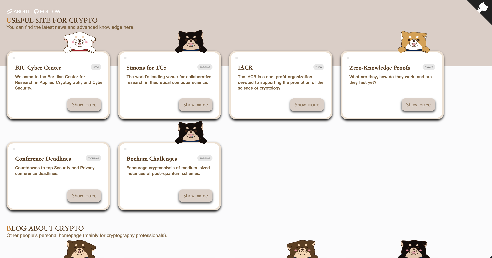

# Useful Links for Crypto

Welcome to the "Useful Links for Crypto" webpage! This webpage is designed to provide a curated list of useful external links related to cryptography, crypto research, blogs, courses, and more. This webpage is an enhanced version of the initial template available at [BootstrapMB](http://www.bootstrapmb.com/item/10801). It has undergone thoughtful redesigning by Mr. + and has been coded by me. Whether you're a cryptography professional or just interested in the field, you'll find valuable resources here.

## Features

- Curated collection of external links related to cryptography.
- Links to crypto research centers, blogs, courses, and personal homepages.
- Engaging design with interactive elements.

## Preview



## Todo

- [x] Add a DBLP link for each person.
- [x] Convert data from HTML to the format of a .yml file, which is easier to add and delete.
- [x] Add a ~~JavaScript~~ Python code that sorts people's information in alphabetical order, with the help of ChatGPT.
- [x] Try to add a workflow for automated deployment.


## Getting Started

1. Clone the repository to your local machine.
2. Open the `index.html` file in your browser to explore the useful links.

## How to Contribute

If you find any broken links, have suggestions for new links, or want to enhance the design, feel free to contribute! Here's how:

1. Fork the repository to your GitHub account.
2. Make your changes, whether fixing links, adding new ones, or improving the design.
3. Submit a pull request with a clear description of your changes.

## Files

- `original.html`: The original HTML template.
- `data/`: Directory containing YAML data files.
  - `sites.yml`: YAML file containing information about useful sites.
  - `scholars.yml`: YAML file containing information about scholars.
  - `courses.yml`: YAML file containing information about courses.
- `index.html`: The updated HTML file generated by the script.
- `generate_html.py`: Python script to generate HTML content and update the HTML template.

## Adding Information to `data_scholars.yml`

To add information about scholars, follow the structure in the YAML file. Each scholar entry should include the following fields:

- `name`: The name of the scholar.
- `dblp`: The link to the scholar's dblp page.
- `introduction`: A brief introduction to the scholar.
- `link`: A link to more information about the scholar.

Here is an overview of `data_scholars.yml` file:

```yaml
scholars:
  - name: John Doe
    introduction: John Doe is a cryptography expert with extensive research experience.
    link: https://example.com/john_doe
    dblp: https://dblp.org/pid/xXxXxXx
  - name: Jane Smith
    introduction: Jane Smith is a renowned cryptographer known for her work in homomorphic encryption.
    link: https://example.com/jane_smith
    dblp: https://dblp.org/pid/yYyYyYy
```

Once you've added the information, the `generate_html.py` script will update the HTML template with the new scholar information.

## Feedback

If you find this webpage useful or have any feedback, don't hesitate to let us know! We appreciate your input and suggestions for improvement.

## Show Your Support

If you find this webpage helpful or interesting, please consider starring this repository. Your support helps us know that you value the effort we've put into creating and maintaining this resource.

## Credits

This webpage was created using HTML, CSS, JavaScript, and the Vue.js framework. It utilizes SVG for visual elements. Special thanks to the open-source community for providing tools and resources that made this project possible.

---

If you enjoy using this webpage, please give it a star! ⭐️
